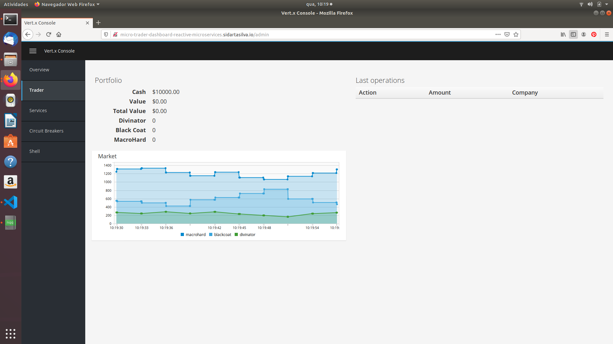

# Building Reactive Microservice Systems

This project is based mainly on the references below.

    <http://escoffier.me/vertx-kubernetes/>

    <https://github.com/yunyu/vertx-console>
    
    ESCOFFIER, C. Building Reactive Microservices in Java Asynchronous and Event-Based Application Design. First Edition. California: O’Reilly Media, Inc., 2017.

    RedHat Developer, accessed 1 November 2019, <https://developers.redhat.com/promotions/building-reactive-microservices-in-java>

    Kubernetes Hands-On - Deploy Microservices to the AWS Cloud 2018, Udemy, accessed 1 November 2019, <https://www.udemy.com/course/kubernetes-microservices>

    <https://github.com/hazelcast/hazelcast-code-samples/>

    <https://vertx.io/docs/vertx-hazelcast>

## The Micro-Trader Application

## Portfolio service

The portfolio service manages your portfolio: the available cash and the owned shares. It is exposed as an async RPC service on the event bus. It consumes the consolidation endpoint from the quote generator and on every successful operation, it sends a message on the event bus.

## Event bus services - Portfolio service

In the portfolio component, we are going to implement an event bus service.

A Portfolio stores the owned shares and the available cash.

In this project, we are going to see:

    * how we can use the event bus to implement asynchronous RPC (Remote Procedure Calls)

    * how to implement a service proxy using callbacks

    * how to publish messages on the event bus

    * how to use the Vert.x Web Client

## RPC and Async RPC

Microservices are not only about REST. They can be exposed using any types of interactions, Remote Procedure Calls being one of them. With RPC, a component can effectively send a request to another component by doing a local procedure call, which results in the request being packaged in a message and sent to the calle.

Likewise, the result is sent back and returned to the caller component as the result of the procedure call.

Such interactions have the advantage of introducing typing, and so are less error-prone than unstructured messages. However, it also introduces coupling between the caller and the callee. The caller knows how to call the calle:

    * How the service is called

    * Where the service is living (location)

Traditional RPC exhibits an annoying drawback: the caller waits until the response has been received. This is definitely a blocking call, as it involves at least two network messages. In addition, it is not really designed for failures while distributed communications have many reasons to fail.

Fortunately, Vert.x proposes a different form of RPC: Async RPC. Async RPC follows the same principles as RPC, but instead of waiting for the response, the result is passed asynchronous.

The AsyncResult notifies the Handler whether the invocation succeeded or failed. Upon success, the handler can retrieve the result.

Using async-RPC has several advantages:

    * The caller is not blocked

    * It deals with failures

    * It avoids sending messages on the event bus and manages object marshalling and unmarshalling for you.

## Async service interface

To create an async RPC service, or event bus service, or service proxies, you first need a Java interface declaring the async methods. Open the PortfolioService class. You will quickly notice that this interface does not use RX Java, but Handlers. This is because the class is used to generate the RX Java, as well as Kotlin versions.

The interface is annotated with

    * ProxyGen - enables the event bus service proxy and server generation

    * VertxGen - enables the creation of the proxy in the different language supported by Vert.x.

Let's have a look at the first method:

            void getPortfolio(Handler<AsyncResult<Portfolio>> resultHandler);

This method lets you retrieve a Portfolio object. As explained above the method is asynchronous and so has a Handler parameter receiving an AsyncResult<Portfolio>. The other methods follow the same pattern.

                    
You may have noticed that the package has a package-info.java file. This file is required to enable the service proxy generation.

## Data objects

The Portfolio object is a data object. Event bus proxies support a limited set of types, and for non-supported types, it must use data objects. Data objects are Java classes obeying a set of constraints:

    * It must be annotated with DataObject

    * It must have an empty constructor, a copy constructor and a constructor taking a JsonObject as parameter

    * It must have a toJson method building a JsonObject representing the current object 

    * Each field must be property with getters and setters

Let's open the Portfolio class to see what it looks like. As you can see all the Json handling is managed by converters that are automatically generated so a Data Object is very close to a simple bean.

## Implementing the Service

It's nice to have an async interface for our service, but it's time to implement it. We are going to implement three methods in this service:

    * getPortfolio to understand how to create AsyncResult objects

    * sendActionOnTheEventBus to see how to send messages on the event bus

    * evaluate computing the current value of the portfolio

### Task - Creating AsyncResult instances

As we have seen above, our async service has a Handler<AsyncResult<Portfolio>> parameter. So when we implement this service, we need to call the Handler with an instance of AsyncResult. To see how this works, let's implement the getPortfolio method.

In PortfolioServiceImpl, fill in the getPortfolio method. It should call the handle method of the resultHandler with a successful async result. This object can be created from the (Vert.x) Future class.

            resultHandler.handle(Future.succeededFuture(portfolio));

Wow... one single line? Let's dissect it:

    * resultHandler.handle: this invokes the Handler. Handler<X> has a single method (handle(x)).

    * Future.succeededFuture: this is how we create an instance of AsyncResult denoting a success. The passed value is the result (portfolio)

But, wait, what is the relationship between AsyncResult and Future?

A Future represents the result of an action that may, or may not have occurred yet. The result may be null if the Future is used to detect the completion of an operation. The operation behind a Future object may succeed or fail. AsyncResult is a structure describing the success or the failure of an operation. So, a Future is an AsyncResult. In Vert.x AsyncResult instances are created from the Future class.

AsyncResult describes:

    * a success as shown before, it encapsulates the result

    * a failure, it encapsulates a Throwable instance

### Task - Sending an event on the event bus

In the previous project, we registered a consumer receiving event bus messages. It's time to see how to send messages on the event bus. You access the event bus using vertx.eventBus(). From this object you can:

    * send: send a message in point to point mode

    * publish: broadcast a message to all consumers registered on the address

    * send with a Handler<AsyncResult<Message>>: send a message in point to point mode and expect a reply. If you use RX Java, this method is called rxSend() and returns a Single<Message>. If the receiver does not reply to the message, it is considered a failure (timeout).

Ok, back to our code. We have provided the buy and sell methods, that are just doing some checks before buying or selling shares. Once the action is emitted, we send a message on the event bus that will be consumed by the Audit Service and the Dashboard. So, we are going to use the publish method.

Write the body of the sendActionOnTheEventBus method in order to broadcast (publish) a message on the EVENT_ADDRESS containing a JsonObject as the body. This object must contain the following entries:

    * action -> the action (buy or sell)

    * quote -> the quote as Json

    * date -> a date (long in milliseconds)

    * amount -> the amount

    * owned -> the updated (owned) amount

            vertx.eventBus().publish(EVENT_ADDRESS, new JsonObject()
                .put("action", action)
                .put("quote", quote)
                .put("date", System.currentTimeMillis())
                .put("amount", amount)
                .put("owned", newAmount));

Let's have a closer look. 

    1. It gets the EventBus instance and calls publish on it. The first parameter is the address on which the message is sent

    2. The body is a JsonObject containing the different information on the action (buy or sell, the quote (another Json object), the date...)

### Task - Coordinating async methods and consuming Http endpoints - Portfolio value evaluation

The last method to implement is the evaluate method. This method computes the current value of the portfolio. However, for this it needs to access the "current" value of the stock (so the last quote). It is going to consume the Http endpoint we implemented in the quote generator. For this, we are going to:

    * Discover the service

    * Call the service for each company in which we own shares

    * When all calls are done, compute the value and send it back to the caller

That's a bit more tricky, so let's do it step by step usinig RX Java 2. First, in the evaluate method, we need to retrieve the Http endpoint (service) provided by the quote generator. This service is named quotes. We published it in the previous section. So let's start it by getting this service.

Fill in the evaluate method to retrieve the quotes service. You can retrieve Http services using HttpEndpoint.rxGetWebClient. Pass a lambda as selecting the "quote-generator" service (svc -> svc.getName().equals("quote-generator")). The `rxGetWebClient method returns a Single (a stream of one item). As it's a stream we must subscribe on it (or nothing will happen). In the subscribe ((client, error) -> {...}), check whether the error is not null. If not, call the resultHandler with a failed future (Future.failedFuture). Otherwise, call the computeEvaluation method.

            Single<WebClient> quotes = HttpEndpoint
                .rxGetWebClient(discovery,                                          // 1
                    service -> service.getName().equals("quote-generator")
                )
            .subscribe((client, err) -> {
                if (err != null) {                                                  // 2
                    resultHandler.handle(Future.failedFuture(err));
                } else {
                    computeEvaluation(client, resultHandler);                       // 3
                }
            });

        1. Get the Web Client for the requested service.

        2. The client cannot be retrieved (service not found), report the failure.

        3. We have the client, let's continue

Here is how the computeEvaluation method is implemented:

        // We need to call the service for each company in which we own shares
        Flowable.fromIterable(portfolio.getShares().entrySet())
            // For each, we retrieve the value
            .flatMapSingle(entry -> getValueForCompany(webClient, entry.getKey(), entry.getValue()))
            // We accumulate the results until the end of the stream
            .toList()
            // And compute the sum
            .map(list -> list.stream().mapToDouble(x -> x).sum())
            // We report the result or failure
            .subscribe((sum, err) -> {
                if (err != null) {
                    resultHandler.handle(Future.failedFuture(err));
                } else {
                    resultHandler.handle(Future.succeeded(sum));
                }
            })

Now, we just need the getValueForCompany method that call the service. This method returns a Single<Double> emitting the numberOfShares * bid result. Write the content of this method following these steps:

    1. use the client.get("/?name=" + encode(company)) to create a Http request

    2. we expect a Json object as response payload, so use .as(BodyCodec.jsonObject())

    3. use the rxSend() method to create a Single containing the result

    4. we now need to extract the "bid" from the returned Json. Extract the response body and then extract the "bid" entry (json.getDouble("bid")). Both extraction are orchestrated using map.

    5. compute the amount (bid * numberOfShared)

    6. Done

    

            private Single<Double> getValueForCompany(WebClient client, String company, Integer numberOfShares) {

                return client.get("/?name=" + encode(company))
                        .as(BodyCodec.jsonObject())
                        .rxSend()
                        .map(HttpResponse::body)
                        .map(json -> json.getDouble("bid"))
                        .map(val -> val * numberOfShares);
            }

## Runtime

There you go, the portfolio service is started. It discovers the quotes service ans is ready to be used.

Going back to the dashboard, we should see some new services and cash should have been set in the top left corner.

